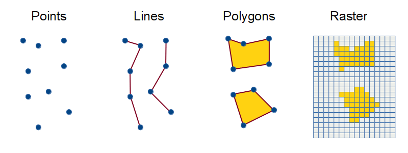

# What is GIS?

A system includes:

- Geographically referenced information collection
- Manipulation and analysis
- Display and report

As its core is spatial database, which includes both **spatial** and **non-spatial (attribute)** data.

## The translation from reality

- Real World

  What actually exists

- Data Model

  The relevant properties of the entity

- Data Structure

  The programming structure which can be incorporated in computer programs

- File Structure

  The files

## The Data Model

Generally, the data model used in GIS includes the **spatial data model** and the **attribute data model**.

### The attribute data model

The non-spatial information attached to each spatial object.

Any information relevant to describe a spatial object.

Normally, it will look like:

|                                |
| ------------------------------------------------------------ |
| Source: [Earth Lab](https://www.earthdatascience.org/courses/use-data-open-source-python/intro-vector-data-python/spatial-data-vector-shapefiles/) |

### Spatial data model

A spatial entity can be defined in terms of:

- Location
- Dimensions
- Attribute
- Time

#### Location (Spatial Reference)

This will be detailed explained in the [Spatial reference](../contents/spatial_reference/coordinatesystem.md)

#### Dimension

##### 1D

Point, Line

##### 2D

Polygon

##### 3D

Volume (another research direction (([3D GIS - USC GIS Online](https://gis.usc.edu/blog/all-about-3d-gis/))), not discussed in this bootcamp)

|                                |
| ------------------------------------------------------------ |
| Source: [Urban Informatics Toolkits: Chapter 26 Spatial Analysis](https://ui.josiahparry.com/spatial-analysis.html) |

##### Time extended

2D, 3D, and time change data

### The Vector & Raster Representation

> Vector is a object-based structure, but Raster is field-based structure.

|                                |
| ------------------------------------------------------------ |
| Source: [Conversion Between Data Models](https://gsp.humboldt.edu/olm/Lessons/GIS/08%20Rasters/RasterToVector.html) |

|                | Raster                           | Vector                                   |
| -------------- | -------------------------------- | ---------------------------------------- |
| **Advantages** | - Simple data structure          | - More compact data structure            |
|                | - More spatial variability       | - More stress on topological information |
|                | - Widely used in satellite image | - More definite boundary                 |

Both raster and vector data are widely used in urban research, raster data is more commonly involved when remote sensing anslysis was implemented, and vector is more common in spatial analysis. 

Now, let's move to [Spatial reference](../contents/spatial_reference/coordinatesystem.md)

