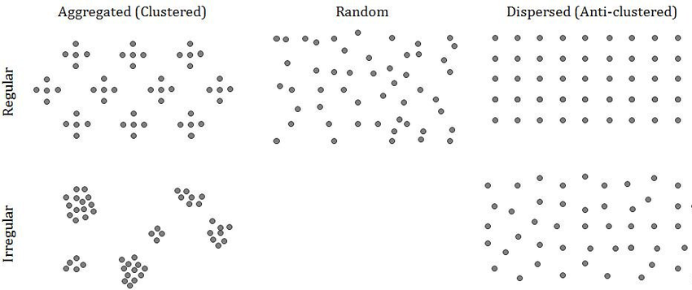
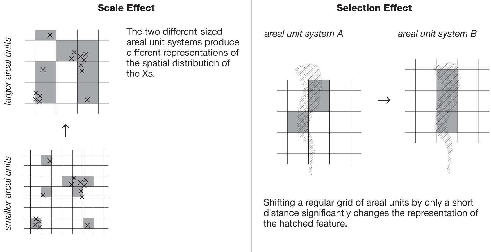

# Spatial Pattern

Spatial analysis investigates spatial pattern and process ([O'Sullivan & Unwin, 2003](https://www.wiley.com/en-us/Geographic+Information+Analysis%2C+2nd+Edition-p-9780470288573)).

- What is the spatial pattern?

  - Random?

    Spatial data **may** have pattern.

  - Trend?

    Spatial dependency

  - Clustered or dispersed?

    Spatial autocorrelation

|         |
| ------------------------------------------------------------ |
| Visual examples of common types of spatial distribution patterns for point data |
| Source: [Developing a Geospatial Protocol for Coral Epizootiology](https://www.researchgate.net/publication/296695387_Developing_a_Geospatial_Protocol_for_Coral_Epizootiology) |

- What process created this pattern?
- Is the pattern always evident?

## Addition: the Modifiable Areal Unit Problem (MAUP)

- **Scale effect**: Different results are obtained when the same set of data are grouped into areal units of different size.
- **Selection effect**: Different results are obtained when the shape or location of same-sized areal units is changed.

|                          |
| ------------------------------------------------------------ |
| The modifiable areal unit problem                            |
| Source: [Analysis of existing urban areas: methodology and data (Appendix B)](https://neptis.org/publications/chapters/analysis-existing-urban-areas-methodology-and-data-appendix-b) |

Select a system of areal units that minimise these effects based on the nature of the research.