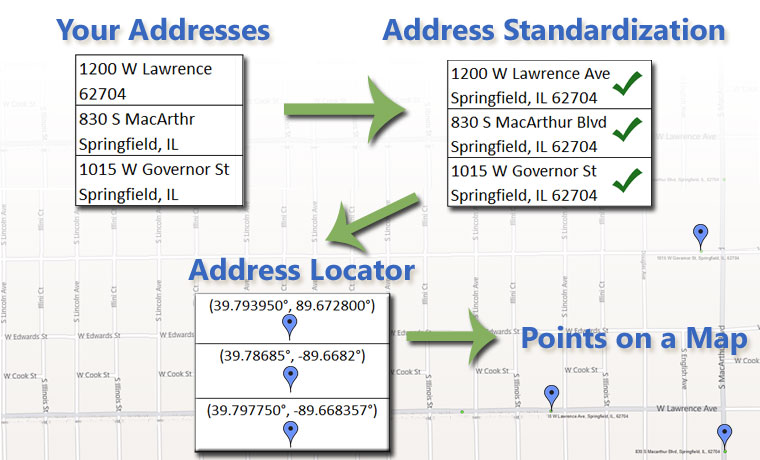
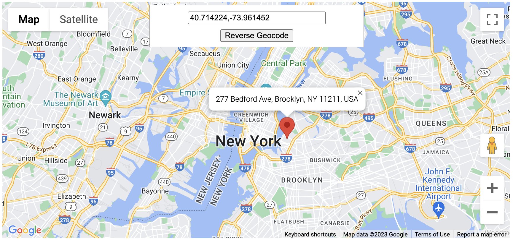

# Geocoding

Geocoding is the process where it converts address into spatial data and associates the exact geographical coordinates for that address.

|  |
| ------------------------------------------- |
|                                             |
|  |
|                                             |

### Common points of confusion and misconceptions

#### Postcodes always represent locations

No, for most countries postcodes represent mail delivery points. Those points may or may not be in fixed locations. For example, many countries assign postcodes to military units. The postcodes stays the same regardless of where the unit is physically based. In many countries large companies or government departments have their own postal code with no correlation to physical location.

#### Postcodes never move or change

No, in most countries there is on-going fluctuations in postcodes. New postcodes are created, old codes are retired, large organization move and take their code with them. Occasionally countries will change their entire postcode system (fun!).

#### Postcodes work roughly the same way in all countries

No, not at all. Almost every aspect of what a postcode is and what it means can differ across countries. The format of the code, the number of people it represents, etc, etc.

#### All countries have postcodes

No, many countries do not have any form of postal code at all. Also, some countries technically have a postcode system, but it is not widely used.

#### Every geographic location belongs to a certain, unique postcode region.

While some countries have assigned postcode regions to all of their territory, many others have not. Remote locations, for example in a large forest, or lakes or other bodies of water, may not fall into any postal region.

#### Locations have a single, unique postcode

No, often large buildings will have multiple postcodes, for example if there are multiple, large organizations based there. Usually it will depend on how many people are at the location (and thus how much mail typically needs to be sent there). An example: skyscrapers in New York can have multiple "zipcodes" (as postcodes are known in the US). Also when postcodes change people will often keep using the old postcode, even after a new postcode has been assigned to the location.

#### Postal systems are unique to a specific country

No, many countries and territories of the world use the postal service of other countries. For example Liechtenstein uses the Swiss postal system. For logistical convenience, exclaves of one country often use the postal system of another country. For example the German exclave [Büsingen uses both the German and Swiss postal services ](https://en.wikipedia.org/wiki/Büsingen_am_Hochrhein#Postal_services).

#### Postcodes are unique to a specific country

No, many countries use strings of numbers as their postal code. So if you just send us a query like `12345` we have no idea which country you mean. Please always also add a country name.

#### Postcodes are always numbers

No, many countries like the UK, Canada, and the Netherlands have alphanumeric codes. Some countries require dashes or spaces in their codes. But even in countries that use only digits in their postal codes it is best to always treat postcodes as strings not numbers, otherwise leading zeros can get removed by formatting software (for example Excel). This is one of the most [common problems we see in geocoding query formatting ](https://opencagedata.com/guides/how-to-format-your-geocoding-query).

## Reference

1. [What is geocoding and how can it help sell products (geospatialworld.net)](https://www.geospatialworld.net/blogs/what-is-geocoding-and-how-can-it-help-sell-products/)
2. [Geocoding and postal codes, points to consider (opencagedata.com)](https://opencagedata.com/guides/how-to-think-about-postcodes-and-geocoding)
