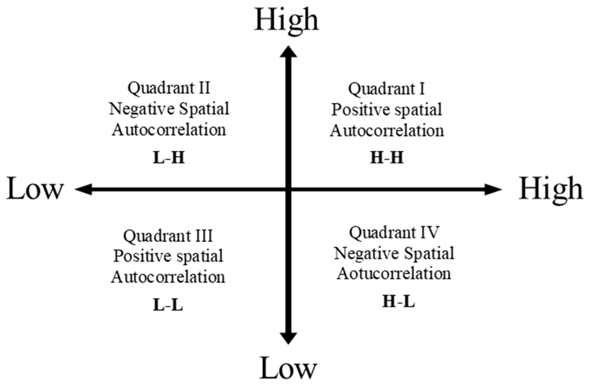

# Local Indicators of Spatial Association (LISA)

The extent of significant spatial clustering of similar values around the observation.

## Anselin Local Moran's I

$$
I_i=(\frac{x_{i}-\bar{x}}{m_2})\cdot\sum_{j=1}^{n}w_{ij}(x_{j}-\bar{x})
$$

$$
m_2=\sum_{i=1}^{n}\frac{(x_{i}-\bar{x})^{2}}{n}
$$

n is the number of cases

xi and xj denote the attribute values at location i, j

x-bar is the mean value of the variable across all spatial units

w_ij denote weights from the spatial weight matrix

**Global Moran’s I is the mean of local Moran’s I**, which we will talk this more detailly in the [Global verses Local Statistics](./globallocal.md)

**Discernible spatial pattern**

- Positive I value

  - Feature is surrounded by features **with similar values**, either high or low.
  - Feature is **part of a cluster**.
  - Statistically significant clusters can consist of high values (HH) or low values (LL)

- Negative I value

  - Feature is surrounded by features **with dissimilar values**.
  - Feature is **an outlier**.
  - Statistically significant outliers can be a feature with a high value surrounded by features with low values (HL) or a feature with a low value surrounded by features with high values (LH).

|                            |
| ------------------------------------------------------------ |
| Spatial autocorrelation of the local indicators of spatial association (LISA) analysis. |
| Source: [An Application of the Spatial Autocorrelation Method on the Change of Real Estate Prices in Taitung City](https://www.mdpi.com/2220-9964/8/6/249) |

## Calculating Local Moran's I in QGIS

1. Load the spatial dataset that you want to analyze into QGIS.
2. Go to the "Vector" menu and select "Spatial Analysis Tools" > "Analyse Spatial Patterns."
3. In the "Analyse Spatial Patterns" window, select the input vector layer that you want to analyze.
4. Choose the variable that you want to analyze. This could be a field in the attribute table that contains numerical data.
5. Choose the type of spatial relationship you want to measure. Local Moran's I calculates the spatial autocorrelation of each feature with its neighboring features.
6. Choose the distance band method. This determines the distance between each feature and its neighbors. The "Fixed distance" option allows you to specify a fixed distance, while the "Distance band" option allows you to specify a range of distances.
7. Specify the distance band or fixed distance, depending on the method you chose.
8. Choose the unit of measurement for the distance band or fixed distance.
9. Choose the output file name and location.
10. Click "Run" to calculate Local Moran's I.