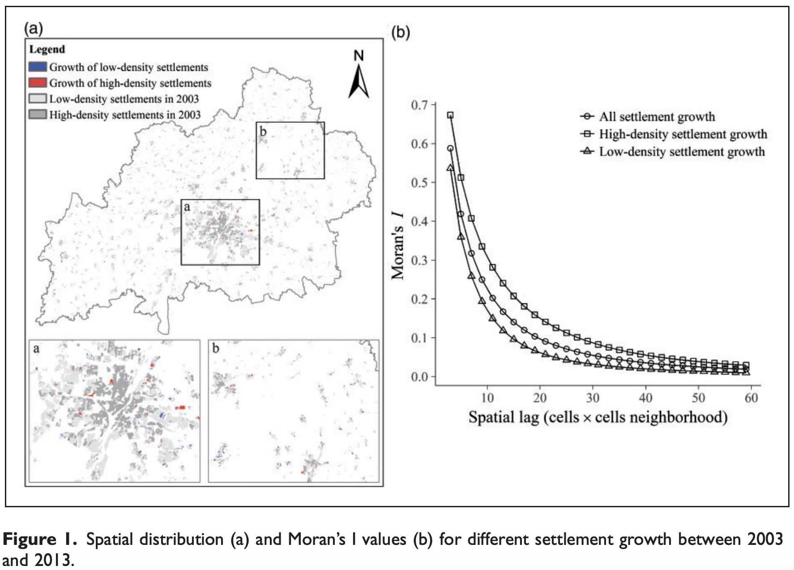
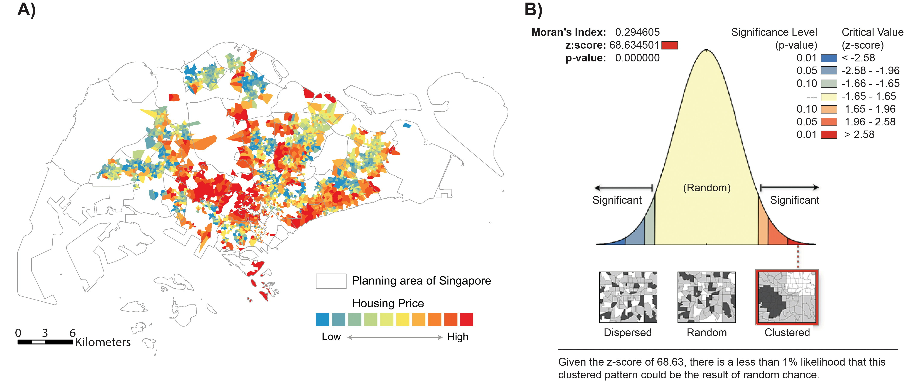

# Spatial Autocorrelation

- Pattern of single variable (univariate data analysis)

- 

| ![Conceptual models of spatial autocorrelation. Positive spatial autocorrelation (a) is associated with a clustering, or aggregating, phenomenon. Positive spatial autocorrelation was observed for all fungal and tree communities at small scales and also across the extent of the study (Fig. 2). Negative spatial autocorrelation (b) was observed for all fungal communities at intermediate scales (3.7–26 km). No spatial autocorrelation (c) is associated with randomly spaced distribution patterns for fungal communities and is also the null hypothesis used in Mantel tests](https://www.researchgate.net/publication/345326470/figure/fig4/AS:960053502804001@1605906000766/Conceptual-models-of-spatial-autocorrelation-Positive-spatial-autocorrelation-a-is.png) |
| ------------------------------------------------------------ |
| Source: [Scale-Dependent Influences of Distance and Vegetation on the Composition of Aboveground and Belowground Tropical Fungal Communities](https://www.researchgate.net/publication/345326470_Scale-Dependent_Influences_of_Distance_and_Vegetation_on_the_Composition_of_Aboveground_and_Belowground_Tropical_Fungal_Communities) |

**Discernible spatial pattern**

- Positive spatial autocorrelation

  **Similar values** of a variable are found near each other in space. 

- Negative spatial autocorrelation

  Neighboring areas or locations have **dissimilar values** for a particular attribute or feature being measured.

**Outcome of Randomness: No spatial pattern**

- No spatial autocorrelation (spatial randomness)

  Absence of any discernible pattern or relationship between neighboring locations in a spatial dataset. 

  This means that the values of a particular attribute or feature being measured are not influenced by the values of nearby locations and are instead distributed randomly across the study area.

## Moran's I

> Moran's I is a statistical measure that quantifies the presence and strength of spatial autocorrelation, measuring the overall spatial autocorrelation of spatial data set. 
>
> It ranges from **-1 to 1**

> As suggested by Glazier et al. (2004), values of Moran’s I > 0.2 or < 0.2 indicate that significant SAC has occurred. 

- A positive Moran's I value (Significant positive)

  Similar values tend to be located close to each other in space. 

- A negative Moran's I value (Significant negative)

  Dissimilar values tend to be located close to each other. 

- A Moran's I value close to zero (Insignificant / Random)

  Values are distributed randomly in space

## Calculating Moran's I in QGIS

1. Generate a spatial weights matrix: The first step in calculating Moran's I in QGIS is to generate a spatial weights matrix that defines the relationship between neighboring locations in your spatial dataset. This can be done using the "Generate Spatial Weights Matrix" tool in the "Processing Toolbox".
2. Select the input layer: Once you have generated the spatial weights matrix, you need to select the input layer for the Moran's I analysis. This layer should be a vector layer that contains the attribute data you want to analyze.
3. Run the Moran's I tool: Next, you can run the Moran's I tool by selecting "Vector analysis" > "Moran's I" from the "Processing Toolbox". In the "Moran's I" dialog box, select the input layer, the attribute column to analyze, and the spatial weights matrix you generated in step 1.
4. Interpret the results: After running the Moran's I tool, QGIS will generate a Moran's I report that includes the Moran's I index, z-score, and p-value. You can interpret these results to determine the presence and strength of spatial autocorrelation in your dataset, as described in the previous answer.
5. Visualize the results: Finally, you can visualize the Moran's I results in QGIS using various tools such as Moran scatterplots, Moran maps, or LISA maps, which show the spatial clusters of similar or dissimilar values in your dataset.

## Interpreting Moran's I results in QGIS

Generate a spatial weights matrix: Before running the Moran's I tool, you need to generate a spatial weights matrix that defines the relationship between neighboring locations in your dataset. This can be done using various methods, such as distance-based methods, contiguity-based methods, or network-based methods.

1. Run the Moran's I tool: Once you have generated the spatial weights matrix, you can run the Moran's I tool in QGIS. The tool will calculate Moran's I index and associated statistical measures such as z-score and p-value.
2. Interpret the results: The Moran's I results in QGIS can be interpreted as follows:

- Moran's I index: This is a measure of the spatial autocorrelation in your dataset, ranging from -1 (perfect negative autocorrelation) to 1 (perfect positive autocorrelation), with 0 indicating no spatial autocorrelation. A positive Moran's I index value suggests that neighboring locations tend to have similar values, while a negative value suggests that neighboring locations tend to have dissimilar values.
- Z-score: This measures the deviation of the observed Moran's I index from the expected value under the null hypothesis of spatial randomness. A z-score greater than 1.96 indicates significant positive spatial autocorrelation, while a z-score less than -1.96 indicates significant negative spatial autocorrelation.
- P-value: This measures the probability of obtaining the observed Moran's I index under the null hypothesis of spatial randomness. A p-value less than 0.05 suggests significant spatial autocorrelation, while a p-value greater than 0.05 suggests no significant spatial autocorrelation.

1. Visualize the results: You can visualize the Moran's I results in QGIS using various tools such as Moran scatterplots, Moran maps, or LISA maps, which show the spatial clusters of similar or dissimilar values in your dataset.

Interpreting Moran's I results in QGIS can provide insights into the underlying spatial processes that generate your data, inform spatial planning and decision-making, and guide the choice of statistical models to account for spatial autocorrelation.

## Applications of Moran's I in Urban Research

### Example 01: 

Xu, C., Pribadi, D.O., Haase, D. and Pauleit, S., 2020. Incorporating spatial autocorrelation and settlement type segregation to improve the performance of an urban growth model. *Environment and Planning B: Urban Analytics and City Science*, *47*(7), pp.1184-1200.

In this study, global Moran's I is used to detect the spatial autocorrelation of land use data (high- and low-density settlement types).

Spatial pattern of settlement growth

The author compared the performace of urban growth model with different settlement types.

### Example 02:

Havard, S., Deguen, S., Zmirou-Navier, D., Schillinger, C. and Bard, D., 2009. Traffic-related air pollution and socioeconomic status: a spatial autocorrelation study to assess environmental equity on a small-area scale. *Epidemiology*, pp.223-230.

## Example 03:

Xu, Y., Santi, P. and Ratti, C., 2022. Beyond distance decay: Discover homophily in spatially embedded social networks. *Annals of the American Association of Geographers*, *112*(2), pp.505-521.

|  |
| ------------------------------------------------------------ |
| Source: The spatial patterns of average housing price at the level of Voronoi cells. (B) Global Moran’s *I* is computed over the housing prices at these Voronoi cells. The analysis and report are derived from ESRI’s ArcGIS product. |

Spatial autocorrelation is used to identify patterns of land use or urban development. For example, by analyzing the spatial autocorrelation of housing prices, researchers can identify areas with similar prices and then investigate the underlying factors that drive the prices.

